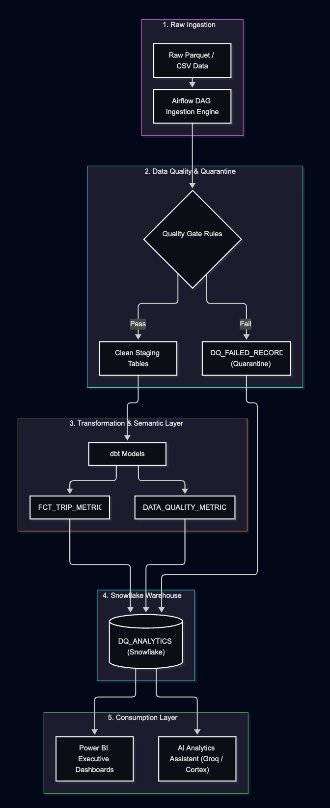
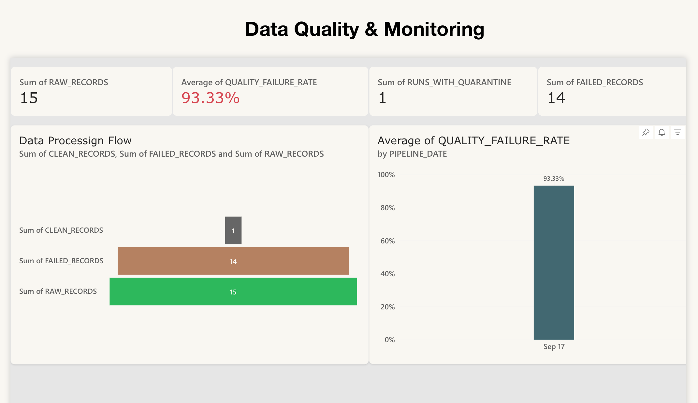
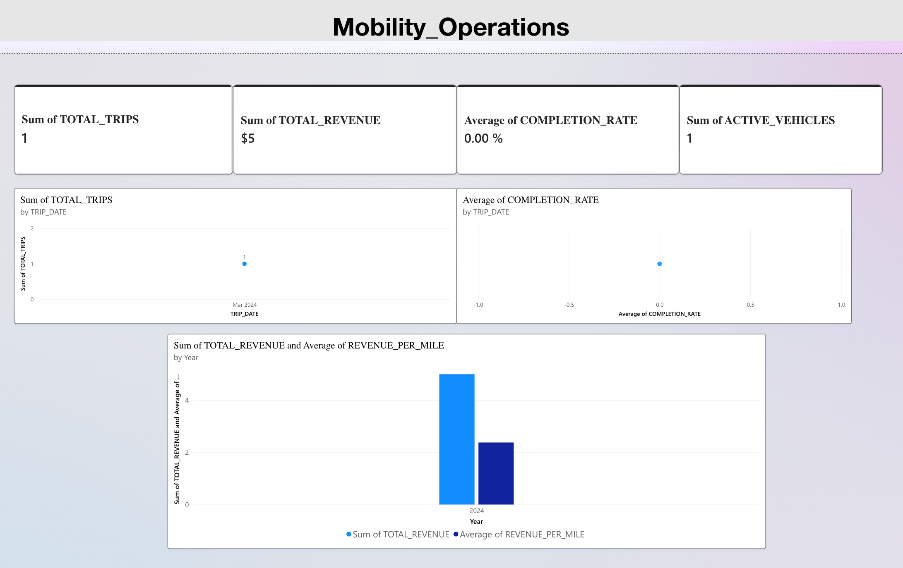
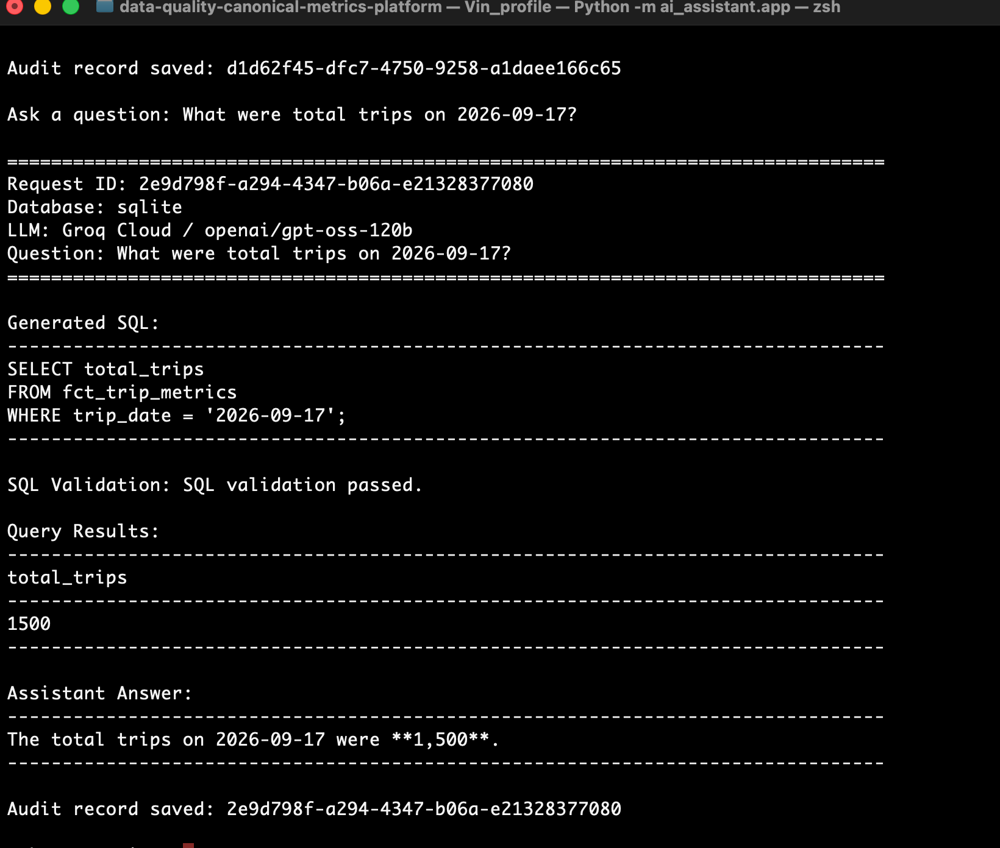

# Data Quality & Canonical Metrics Platform with AI Analytics Assistant

> A production-style analytics engineering platform that transforms operational data into trusted canonical metrics through automated data-quality validation, quarantine, remediation, orchestration, and BI reporting — with an AI assistant for governed natural-language analytics.



## Overview

Modern analytics systems are only as reliable as the data and metric definitions behind them.

This project demonstrates an end-to-end analytics engineering workflow for operational trip and delivery data:

**Raw Data → Staging → Quality Validation → Quarantine → Remediation → Analytics → Canonical Metrics → BI → AI Analytics**

The platform combines deterministic data engineering controls with an LLM-powered analytics interface. The AI assistant does not directly trust generated SQL; queries are constrained by approved metrics and dimensions, validated before execution, and logged for auditability.

---

## What This Project Demonstrates

### Analytics Engineering

* Layered data modeling with dbt
* Reusable analytical models
* Canonical metric definitions
* SQL-based transformations
* BI-ready datasets

### Data Quality & Governance

* Record-level validation
* Duplicate detection
* Failure classification
* Quarantine of invalid records
* Deterministic remediation
* Revalidation
* Pipeline auditability

### Orchestration

* Apache Airflow pipeline orchestration
* Scheduled dbt execution
* Pipeline run tracking
* Success / quarantine-aware completion status

### Business Intelligence

* Power BI operational reporting
* Executive KPI monitoring
* Data-quality monitoring
* Trend analysis

### AI-Assisted Analytics

* Natural-language business questions
* Groq Cloud LLM
* Governed SQL generation
* SQLGlot validation
* Read-only query execution
* Result explanation
* AI request auditing

---

# Architecture

```text
                         ┌──────────────────────┐
                         │     Raw Data         │
                         └──────────┬───────────┘
                                    │
                                    ▼
                         ┌──────────────────────┐
                         │      dbt Staging     │
                         └──────────┬───────────┘
                                    │
                                    ▼
                         ┌──────────────────────┐
                         │   Quality Validation │
                         └──────────┬───────────┘
                                    │
                       ┌────────────┴────────────┐
                       │                         │
                       ▼                         ▼
                ┌─────────────┐          ┌──────────────┐
                │ Clean Data  │          │ Failed Data  │
                └──────┬──────┘          └──────┬───────┘
                       │                        │
                       │                        ▼
                       │                 ┌──────────────┐
                       │                 │  Quarantine  │
                       │                 └──────┬───────┘
                       │                        │
                       │                        ▼
                       │                 ┌──────────────┐
                       │                 │ Remediation  │
                       │                 └──────┬───────┘
                       │                        │
                       │                        ▼
                       │                 ┌──────────────┐
                       │                 │ Revalidation │
                       │                 └──────┬───────┘
                       │                        │
                       └────────────┬───────────┘
                                    │
                                    ▼
                         ┌──────────────────────┐
                         │  Analytics Models    │
                         └──────────┬───────────┘
                                    │
                                    ▼
                         ┌──────────────────────┐
                         │ Canonical Metrics    │
                         └──────────┬───────────┘
                                    │
                         ┌──────────┴───────────┐
                         ▼                      ▼
                  ┌─────────────┐       ┌─────────────────┐
                  │   Power BI  │       │ AI Analytics    │
                  │  Dashboard  │       │    Assistant    │
                  └─────────────┘       └────────┬────────┘
                                                 │
                                                 ▼
                                        ┌─────────────────┐
                                        │   Groq Cloud    │
                                        │       LLM       │
                                        └────────┬────────┘
                                                 │
                                                 ▼
                                        ┌─────────────────┐
                                        │ SQL Generation   │
                                        └────────┬────────┘
                                                 │
                                                 ▼
                                        ┌─────────────────┐
                                        │ SQLGlot         │
                                        │ Validation      │
                                        └────────┬────────┘
                                                 │
                                                 ▼
                                        ┌─────────────────┐
                                        │ Read-only Query │
                                        └────────┬────────┘
                                                 │
                                                 ▼
                                        ┌─────────────────┐
                                        │ Result          │
                                        │ Explanation     │
                                        └────────┬────────┘
                                                 │
                                                 ▼
                                        ┌─────────────────┐
                                        │ Audit Logging   │
                                        └─────────────────┘
```

---

# Data Pipeline

## 1. Raw Layer

Operational trip records are entered into the raw layer with source metadata and ingestion timestamps.

The raw data includes attributes such as:

* trip ID
* vehicle ID
* start and completion timestamps
* distance
* duration
* delivery status
* fare
* source file

## 2. Staging Layer

dbt staging models standardize source fields and normalize values before downstream processing.

Example:

```text
delivery_status
       ↓
lowercase + trim
       ↓
standardized status
```

## 3. Data Quality Layer

Records are evaluated against deterministic validation rules.

Current quality checks include:

* missing trip ID
* duplicate trip ID
* missing vehicle ID
* negative distance
* negative fare
* invalid duration
* invalid timestamp sequence
* invalid delivery status

Each validation result is associated with pipeline metadata and a record hash for traceability.

## 4. Quarantine

Records that fail validation are separated from clean analytical data.

The quarantine layer preserves information such as:

* failure key
* pipeline run ID
* record hash
* trip ID
* vehicle ID
* failure reason
* remediation status
* detection timestamp

This prevents invalid records from silently contaminating analytical metrics.

## 5. Remediation

Only deterministic and low-risk corrections are automatically remediated.

Examples:

```text
completeed → completed
" Completed " → "completed"
```

Issues such as negative fare, negative distance, missing vehicle IDs, impossible timestamps, and duplicates are not automatically altered.

This separates **safe deterministic remediation** from issues requiring investigation.

## 6. Analytics Layer

Only records that pass validation are included in the primary analytical models.

The project includes analytical facts and metric models designed for BI consumption.

---

# Canonical Metrics

A core design principle is to centralize business logic in reusable metric definitions rather than allowing every dashboard or analyst to recalculate metrics independently.

Current canonical metrics include:

| Metric               | Definition                              |
| -------------------- | --------------------------------------- |
| Total Trips          | Count of valid analytical trip records  |
| Completed Trips      | Trips with completed delivery status    |
| Canceled Trips       | Trips with canceled delivery status     |
| In-Progress Trips    | Trips currently in progress             |
| Completion Rate      | Completed trips divided by total trips  |
| Average Duration     | Average trip duration in seconds        |
| Average Distance     | Average trip distance in miles          |
| Total Distance       | Total valid trip distance               |
| Total Revenue        | Revenue from valid analytical trips     |
| Revenue per Mile     | Total revenue divided by total distance |
| Active Vehicles      | Number of active vehicles               |
| Quality Failure Rate | Failed records divided by raw records   |

Full metric definitions are documented in:

`docs/canonical_metrics.md`

---

# Airflow Orchestration

Apache Airflow orchestrates the end-to-end analytical pipeline.

The DAG:

`orchestration/airflow_dag.py`

coordinates:

1. Pipeline run initialization
2. dbt model execution
3. Data-quality processing
4. Analytical model creation
5. Pipeline completion auditing

The DAG is designed to be portable across environments and does not depend on a developer-specific filesystem path.

The local Airflow runtime is intentionally kept outside the Git repository.

---

# Power BI

The Power BI layer provides an operations and data-quality dashboard.



Additional dashboard view:



The report includes:

* Total Trips
* Completion Rate
* Total Revenue
* Active Vehicles
* Daily trip trends
* Completion-rate trends
* Revenue trends
* Quality failure rate
* Failed-record counts
* Failure reasons
* Pipeline quality status
* Remediation information

The goal is to provide both an operational view and a data-reliability view from the same governed analytical layer.

---

# AI Analytics Assistant

The AI assistant allows business users to ask analytical questions without writing SQL.

Example:

```text
What were the total trips on 2026-09-17?
```

The application follows this workflow:

```text
Natural Language Question
          ↓
Canonical Metric Context
          ↓
Groq Cloud LLM
          ↓
SQL Generation
          ↓
SQLGlot Validation
          ↓
Read-only Query Execution
          ↓
Query Result
          ↓
Business Explanation
          ↓
Audit Log
```



## Why the AI layer is governed

The assistant is constrained to approved analytical definitions.

It is designed to:

* Use canonical metrics where possible
* avoid inventing tables or columns
* generate read-only queries
* reject forbidden SQL operations
* validate generated SQL before execution
* explain results using only the returned data
* log AI requests for traceability

The LLM is therefore an interface to the analytical layer, **not the source of truth**.

---

# SQL Safety Layer

Generated SQL passes through a dedicated validation layer before execution.

The validator checks for:

* single SQL statement
* read-only query behavior
* approved tables
* approved columns
* forbidden SQL operations
* unsupported parameter placeholders
* unauthorized data access

This adds a control boundary between the LLM and the database.

---

# Auditability

The AI assistant records query execution metadata in an audit table.

Captured information includes:

* request ID
* original question
* normalized question
* generated SQL
* validation status
* validation message
* execution status
* execution errors
* row count
* execution time
* generated answer
* model
* database dialect
* creation timestamp

This allows an analytics request to be traced from the original question through SQL generation and execution to the final business response.

---

# Database Architecture

The project separates the application from its database implementation through a database adapter.

```text
AI Assistant
     │
     ▼
Database Adapter
     │
     ├──────────────► SQLite
     │                  │
     │                  └── Reproducible local demo
     │
     └──────────────► Snowflake
                        │
                        └── Cloud warehouse target
```

The repository includes a Snowflake setup script and Snowflake connector implementation while using SQLite as the reproducible local demo runtime.

This allows the application architecture to remain database-independent.

---

# Technology Stack

| Category                 | Technology     |
| ------------------------ | -------------- |
| Programming              | Python         |
| Querying                 | SQL            |
| Transformation           | dbt            |
| Orchestration            | Apache Airflow |
| Local Analytics Runtime  | SQLite         |
| Cloud Warehouse Adapter  | Snowflake      |
| BI                       | Power BI       |
| LLM                      | Groq Cloud     |
| SQL Parsing / Validation | SQLGlot        |
| Testing                  | pytest         |
| CI                       | GitHub Actions |

---

# Repository Structure

```text
data-quality-canonical-metrics-platform/
│
├── .github/
│   └── workflows/
│       └── ci.yml
│
├── ai_assistant/
│   ├── app.py
│   ├── explainer.py
│   ├── prompts.py
│   ├── schema_context.py
│   ├── sql_generator.py
│   ├── sql_validator.py
│   └── database/
│       ├── adapter.py
│       ├── audit.py
│       ├── local.py
│       ├── setup_local.py
│       └── snowflake.py
│
├── dbt/
│   ├── dbt_project.yml
│   ├── macros/
│   └── models/
│       ├── staging/
│       ├── quality/
│       └── marts/
│
├── docs/
│   ├── canonical_metrics.md
│   └── requirements.md
│
├── ingestion/
│   └── generate_bad_data.py
│
├── orchestration/
│   └── airflow_dag.py
│
├── screenshots/
│   ├── Platform_architecture.png
│   ├── PowerBI_dashboard.png
│   ├── PowerBi_dashboard2.png
│   └── digital_assistant_demo.png
│
├── seeds/
│   └── raw_trips.csv
│
├── snowflake/
│   └── 01_setup.sql
│
├── tests/
│   └── test_generate_bad_data.py
│
├── .env.example
├── .gitignore
├── LICENSE
├── README.md
├── pytest.ini
└── requirements.txt
```

---

# Local Demo Setup

The AI assistant can be run locally without requiring a live Snowflake session.

## 1. Configure environment variables

Create a local `.env` file:

```env
GROQ_API_KEY=your_groq_api_key
DATABASE_DIALECT=sqlite
```

The repository includes `.env.example` as a template.

**Never commit `.env` or credentials to GitHub.**

## 2. Initialize the local analytics database

```bash
python ai_assistant/database/setup_local.py
```

## 3. Run the AI Analytics Assistant

```bash
python -m ai_assistant.app
```

## 4. Example questions

```text
What were the total trips on 2026-09-17?
```

```text
What was the completion rate on 2026-09-18?
```

```text
Which day had the highest total revenue?
```

```text
Show total trips and completion rate by trip date.
```

---

# Testing

Run the project tests with:

```bash
pytest
```

Python syntax checks can also be performed with:

```bash
python -m py_compile ai_assistant/app.py
python -m py_compile ai_assistant/sql_generator.py
python -m py_compile ai_assistant/sql_validator.py
python -m py_compile orchestration/airflow_dag.py
```

The repository also includes a GitHub Actions CI workflow.

---

# Security

The project follows basic secret-management practices:

* API credentials are loaded from environment variables
* Snowflake credentials are not hard-coded
* `.env` files are ignored by Git
* Private Snowflake keys are excluded from Git
* Local database files are excluded from Git
* LLM-generated SQL is validated before execution
* The analytics assistant is designed for read-only access

The public repository intentionally contains configuration templates rather than credentials.

---

# Key Engineering Decisions

### Canonical metrics instead of duplicated business logic

Metric definitions are centralized so analytical users and dashboards reference consistent calculations.

### Quarantine instead of silently dropping bad records

Failed records are retained with failure reasons so data-quality issues remain observable and traceable.

### Deterministic remediation

Only low-risk, explicitly defined corrections are automated.

### Validation before execution

The LLM generates candidate SQL, but a dedicated validator controls what can reach the database.

### Database adapter

The application separates database execution from the rest of the assistant, allowing local development and cloud deployment to use different implementations.

### Reproducible local runtime

SQLite provides a simple local demonstration environment that does not require a cloud account to run the AI assistant.

---

# Portfolio Takeaway

This project demonstrates how analytics engineering can connect:

**Data Quality + Data Modeling + Orchestration + Canonical Metrics + BI + AI-assisted Analytics**

The central design principle is simple:

> **Trusted data and governed metrics come first; AI sits on top of that foundation.**

This makes the platform useful not only as an AI demonstration but as an end-to-end analytics engineering project focused on reliability, consistency, and controlled access to analytical data.

---

## License

This project is licensed under the terms provided in the repository's `LICENSE` file.
